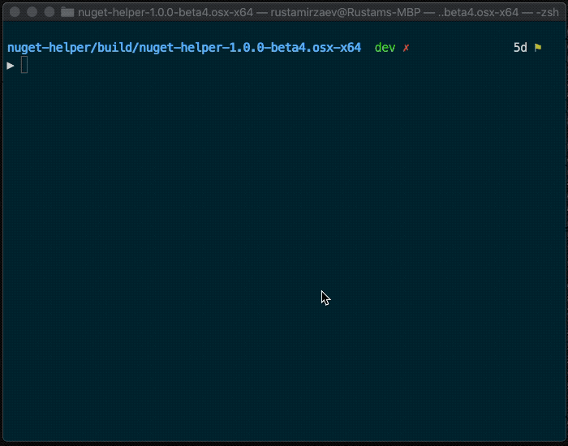

# NuGet Helper

`NuGet Helper` is a powerful tool that helps you working with licenses inside projects and much more.

Here are what you can achive using this tool:

* Generate [LICENSE-DEPENDENCIES.md](assets/LICENSE-DEPENDENCIES.MD) ([example](assets/LICENSE-DEPENDENCIES.MD)) file that contains information about all NuGet packages used in a whole solution (including version, link to a license file and more)
* Supports both: `.Net Core` and `.Net Framework` projects structure
* Show information about each `*.csproj` file (detects framework version, checks if the project is .Net Core or .Net Framework project)
* Check and parse `packages.config` file

---




---

## Download

Get the latest binaries [from here](https://github.com/RustamIrzaev/NuGetHelper/releases) _(supports Windows, MacOS and Linux)_.

There are two kind of archives per each platform: with and without **_full_** suffix.

> If you are not sure which to download, use `_full` version.


### `_full` suffix
Packages with **_full** suffix are [self-contained applications](https://docs.microsoft.com/en-us/dotnet/core/deploying/#self-contained-deployments-scd), thus **do not** require dotnet framework to be installed, while packages without that suffix are [framework-dependent](https://docs.microsoft.com/en-us/dotnet/core/deploying/#framework-dependent-deployments-fdd) applications and they do need standalone dotnet framework installed.

## How to use (easy way)

All parameters will be set to their default values as specified in Parameters section.

### Mac\Linux

* Change permissions for executing the script

   ```bash
   chmod +x ./run.sh
   ```

* Execute the script

   ```bash
   # PROJECT_FOLDER is a full folder path to your .Net project
   ./run.sh "<PROJECT_FOLDER>"
   ```

### Windows

* Execute the script

   ```powershell
   .\run.ps1 "<PROJECT_FOLDER>"
   ```

_And do not forget to visit this page to check if a new version is available._

## How to use (advanced way)

Run the tool with parameters you need directly using `dotnet cli`.

For example

```powershell
dotnet NuGetHelper.Tool.dll --solution-folder "<PROJECT_FOLDER>" --generate-license
```

## Parameters

|Parameter|Required?|Description|Default value|
|---|---|---|---|
|**--solution-folder** _or_ **--folder**|**yes**|A path to a folder where the projects is located|**-**|
|**-generate-license** _or_ **--license**|_no_|Generates [LICENSE-DEPENDENCIES.md](assets/LICENSE-DEPENDENCIES.MD) file|**true**|
|**--load-metadata**|_no_|Loads package information from [NuGet](http://nuget.org) _(Tags, Summary, Description and more)_|**true**|
|**--ignore-cli-tools**|_no_|Ignores CLITools<br>_(Works only on .Net Core projects)_|false|
|**--ignore-packages-config**|_no_|Ignores packages.config file processing|false|
|**--print-results**|_no_|Writes all information to console|false|
|**--short**|_no_|Ignores the metadata if set to true|false|

## Building the tool (advanced users)

Follow [this](assets/how-to-build.md) guide.

## Contributing

Feel free to create pull requests.

## License

This project is licensed under terms of the MIT license. See the [LICENSE.md](LICENSE.md) file.

* For [System.CommandLine](https://github.com/dotnet/command-line-api), see [https://github.com/dotnet/command-line-api/blob/master/LICENSE.md](https://github.com/dotnet/command-line-api/blob/master/LICENSE.md)

* For [NuGet.Protocol](https://github.com/NuGet/NuGet.Client), see [https://github.com/NuGet/NuGet.Client/blob/dev/LICENSE.txt](https://github.com/NuGet/NuGet.Client/blob/dev/LICENSE.txt)

---
Made with ❤️ by Rustam Irzaev
